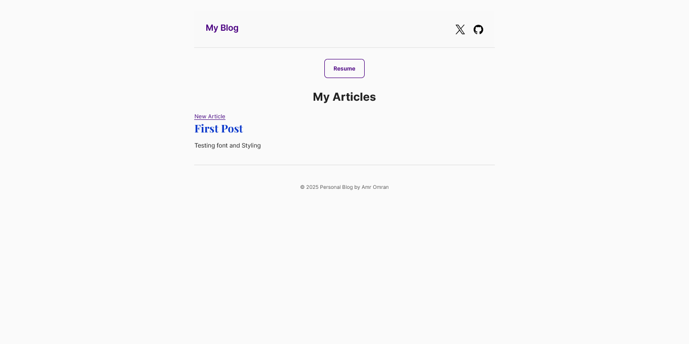
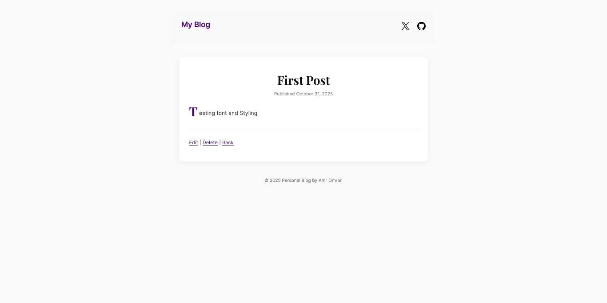
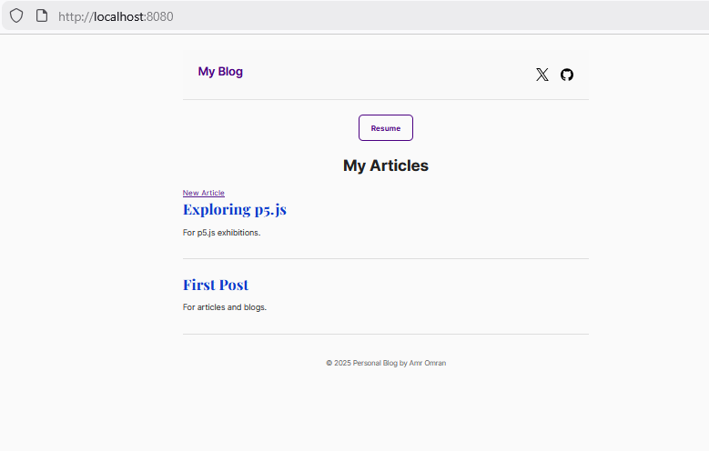

# Rails JS

A modern Ruby on Rails 8 application for personal blog/site management with PostgreSQL and a basic frontend.




## Locally deployed with docker


## Features

- Article management system (CRUD operations)
- PostgreSQL database
- Rails 8 with Hotwire (Turbo & Stimulus)
- Importmap for JavaScript management
- Solid Queue for background jobs
- Solid Cache for caching
- Solid Cable for WebSockets
- Docker support with Kamal deployment
- Comprehensive test suite with RSpec
- Code quality checks with RuboCop

## Requirements

- **Ruby version**: 3.4.7
- **Rails version**: 8.0.3
- **Database**: PostgreSQL

## Installation

1. **Clone the repository**
   ```bash
   git clone <https://github.com/amromran/miscellaneous_blog>
   cd miscellaneous_blog
   ```

2. **Install dependencies**
   ```bash
   bundle install
   ```

3. **Set up environment variables**
   ```bash
   cp .env.example .env
   # Edit .env with your configuration
   ```

4. **Set up the database**
   ```bash
   rails db:create
   rails db:migrate
   rails db:seed
   ```

## Running the Application

### Development Server

```bash
bin/rails server
```

### Local Production Test (Docker Compose)

Run the app and a PostgreSQL database locally using Docker. Check the Dockerfile.

1. Ensure you have Docker Desktop (or Engine) installed and running.
2. Copy environment file and fill values:
   ```bash
   cp .env.example .env
   # Edit .env and set RAILS_MASTER_KEY to the contents of config/master.key
   ```
3. Start the stack:
   ```bash
   docker compose up --build
   # or detached
   docker compose up -d --build
   ```
1. Ensure you have Docker Desktop (or Engine) installed.
2. Setup environment:
   ```bash
   cp .env.example .env
   # Ensure RAILS_MASTER_KEY is set in .env (copy from config/master.key)
   ```
3. Start the stack:
   ```bash
   docker compose up --build
   ```
4. Open http://localhost:8080

## Deployment

This application is configured for zero-downtime deployment using [Kamal](https://kamal-deploy.org/).

### Prerequisites

1. **Servers**: A Linux server (Ubuntu/Debian recommended) with SSH access.
2. **Registry**: A container registry (Docker Hub, GHCR) to host your images.
3. **DNS**: A domain pointing to your server IP (if using SSL).

### 1. Configuration

Edit `config/deploy.yml`:
- Update `image:` to your registry repository (e.g., `username/filename`).
- Update `servers:` with your server IP addresses.
- Update `registry:` settings if not using Docker Hub.

### 2. Secrets

Secrets are managed via `.kamal/secrets` and environment variables.

**Locally**, export the required keys before running Kamal commands:
```bash
export RAILS_MASTER_KEY=$(cat config/master.key)
export KAMAL_REGISTRY_PASSWORD="your_registry_token"
```

### 3. Deploy

Run the following commands from your local machine:

```bash
# Initial setup (run once to install Docker & Traefik on servers)
bin/kamal setup

# Deploy new version
bin/kamal deploy
```

### Useful Commands

```bash
bin/kamal logs          # Tail logs across servers
bin/kamal app exec -i bash  # Open a shell inside the running container
bin/kamal rollback      # Rollback to the previous version
```
